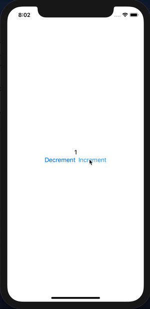

# :rocket: SwiftUI-Flux
This is a tiny experimental application using `SwiftUI` with `Flux architecture`.  



```swift
struct CounterView : View {
    enum Action {
        case increment
        case decrement
    }

    @State var store = Store<Int, Action>(initial: 0) { count, action in
        switch action {
        case .increment:
            return count + 1

        case .decrement:
            return max(0, count - 1)
        }
    }

    var body: some View {
        VStack {
            Text("\(store.state)")

            HStack {
                Button(action: { self.store.dispatch(action: .decrement) }) {
                    Text("Decrement")
                }

                Button(action: { self.store.dispatch(action: .increment) }) {
                    Text("Increment")
                }
            }
        }
    }
}
```

## :clipboard: Requirements
- Swift5.1 Beta
- Xcode11.0 Beta
- iOS 13.0 Beta

## :memo: License

SwiftUI-Flux is released under the [MIT License](./LICENSE).